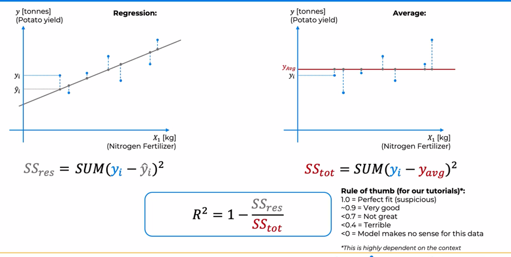
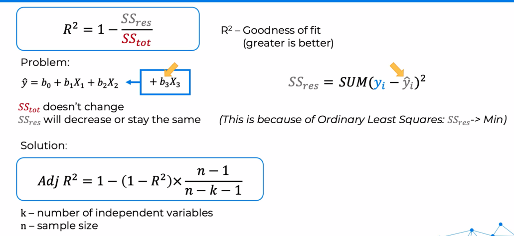
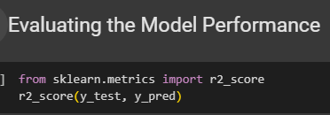

# RSquared Intuition

&nbsp;&nbsp;&nbsp;Today, we're talking about the R squared, a very important concept when it comes to evaluating the goodness of fit of our models.  
Now, in order to understand R squared, we're going to need to look at two versions of our chart. So here is our data set, and what we're going to do here is plot the regression as we were doing before. And here's our data set, again, and this time we're going to just plot an average line, and we'll see that in a second. So we'll start with the regression. Let's draw our regression line. As usual, let's project vertically our data points onto it. And for each data point, we're going to look at the difference between yi, the actual value, and yi hat, the predicted value.Now as we discussed before, the way we built this line is we are minimizing this sum over here, and that is the ordinary least squares method. Well, actually this sum has a name, it's called the `residual sum of squares`.  
&nbsp;&nbsp;&nbsp;Now on the right here, we're going to draw an average line, and this is simply taking all of the y values, So the actual values of our data set, the y values, and taking their average. Again, we're going to project vertically our data points onto this line. And for each data point, we're going to look at yi. And here we're going to calculate another total. And this one is called the `total sum of squares`.  
And it's similar to the residual sum squares, but instead of using yi hat, we're looking at the difference between yi, the actual value, and y average, the average value of our data set. And now we can calculate R squared.  
&nbsp;&nbsp;&nbsp;R squared is defined as one minus the ratio between the residual sum squares and the total sum of squares.  
So we know that we're minimizing the residual sum squares. We wanna make it as small as possible. And from these two images, you can already see just by judging based on the lengths of these blue dotted, blue dashed lines, we can see that they're generally longer on the right where the average is and they're shorter where the regression is. And that's because we've designed our line to minimize these lengths, so the sum squared is smaller. And so what that means is that the residual sum squares is usually, in most cases, it's less than the total sum of squares. So the way to think about it is in the total sum squares on the right, you're just putting an average line, you're not modeling anything.  
&nbsp;&nbsp;&nbsp;This is the most rudimentary thing that we can do is just put our average line and approximate our data with that average line. Of course, it will be, and it should be worse than any thought out model that we create, which is the example on the left. So thereby, unless our regression model is facing absolutely the wrong way, for example, a downward slope on the left over here, if our model was sloping downwards, then the residual sum of squares would be huge because our model's just incorrect. But in all other cases the residual sum of squares is less than the total sum squares. And what that means is that the ratio is less than one. So R squared is somewhere between zero and one. And the better our model fits the data, the smaller the residual sum of squares will be, and that means the greater R squared will be. So here's a quick rule of thumb for R squared.  
&nbsp;&nbsp;&nbsp;Now bear in mind that it highly depends on the context, and this rule of thumb is just for the practical tutorials that we're looking at in this section of the course.

# Adjusted RSquared Intuition

&nbsp;&nbsp;&nbsp;Previously we discussed R Squared,which is defined as one minus the residual sum of squared divided by the total sum of squared and R Squared is a goodness of fit. For our models, greater is better. Just a quick reminder, we mentioned that R Squared is between zero and one, and that there is no overarching rule of thumb. The values really depend on the industry and use case. So, for some industries and use cases, 0.9 might be a great R Squared and 0.4 might be a terrible R Squared. For other industries and use cases, 0.4 might be a great R Squared. So, it really depends.  
&nbsp;&nbsp;&nbsp;However, there is an overarching problem across the board which is to do with adding new independent variables. So, let's say we have a linear regression with two independent variables and we decide to add a third one. For example, we got new data, a new column of data, or we got, we're just trying to explore and see what other variables might be helpful in the explanation in our model. So, what happens when we add another variable is that the total sum of squares doesn't change because it only depends on the average of the y actual values and doesn't depend on the y-hat values. But the residual sum of squares will change and in fact it will only either decrease or stay the same. The problem we are facing is that the residual sum of squares will never increase when we try to add another variable, and this might not be intuitive at first, so let's talk about it a little bit.  
&nbsp;&nbsp;&nbsp;The main reason for this is that we are using the Ordinary Least Squares method to build our models. And what the Ordinary Least Squares method does is it aims to minimize the residual sum of squares. So, let's try, see this in action :   
When we add this new variable, X3, the Ordinary Least Squared method is going to look for coefficient b3 that improve the yi-hat predicted values. As long as it finds a coefficient b3 where the yi-hat values are better than they were before, closer to the actual values, then the residual sum of squares will improve. It could improve by a lot if the prediction is much better now or it can improve by a tiny little bit, even if the prediction is a little bit better. Now in the situation where the Ordinary Least Squares method cannot find a coefficient b3 that improves the predictions, like all possible coefficients b3 make the predictions worse, then the Ordinary Least Squared method is just going to be very smart or sneaky you can call it. And it's just going to turn b3 into zero.  
&nbsp;&nbsp;&nbsp;It's just going to say, okay, we are going to set b3 at zero and that means even though we technically added an extra variable, it's not participating at all in the predictions because its coefficient is zero. So, in that case, the residual sum of squares won't change, will be exactly as it was before. So, we end up with a situation where we can just keep adding more and more variables that maybe have even nothing to do with our problem at hand. But by virtue of some random correlations, our R Squared in some cases will be improving, improving, improving. It never gets worse. So, the residual sum of squares will decrease. That means R Squared will increase. And that's a problem because we don't want to end up with models that have lots of variables that have nothing to do with that model, that are not really adding a lot of value, but in general are just increasing R Squared.  
&nbsp;&nbsp;&nbsp;So, what is the solution?  
The solution is a new version of R Squared, an Adjusted R Squared, and that's exactly what it's called. It is calculated with this scary looking formula. You'll be able to recreate this, actually, manually. So, here there are a couple of new parameters. k is the number of independent variables that are in our model, and n is the sample size. And the important thing here is to look at k. So if we, if k increases over here, then the denominator decreases. That means the whole ratio increases. And because it's being subtracted, that means Adjusted R Square decreases. So, that's the important point here, that this new formula penalizes us for adding additional variables. So, basically it's only worth adding an extra variable if R Squared, this original R Squared, if it increases substantially enough that compensates for this penalty. So, when you're adding new variables becomes something that has to be justified. If it's not justified, then the new variable's not worth adding. And that's what Adjusted R Squared is about. It's about making sure that we only add variables when they bring substantial improvement to our model.

