# Machine-Learning-A-Z-Model-Selection

&nbsp;&nbsp;&nbsp;Now we are finally going to get an answer to that ultimate question: How do I know which regression model to choose for a particular problem/dataset?  
Well we are all going to answer this question together and to do this, I've prepared for you a folder containing all the regression code templates, and a generic real-world dataset which we will use to answer that question above. Here is the link to the whole Model Selection folder.  

https://drive.google.com/open?id=1O8vabaxga3ITjCWfwD79Xnyf8RavYuyk

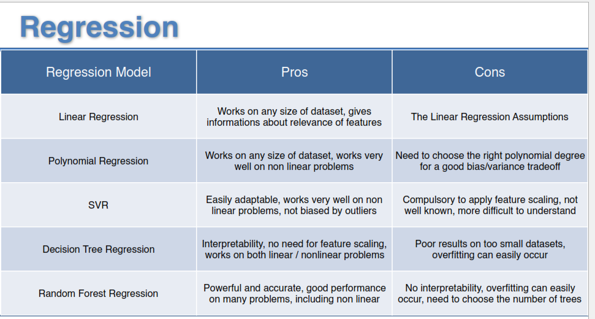

  
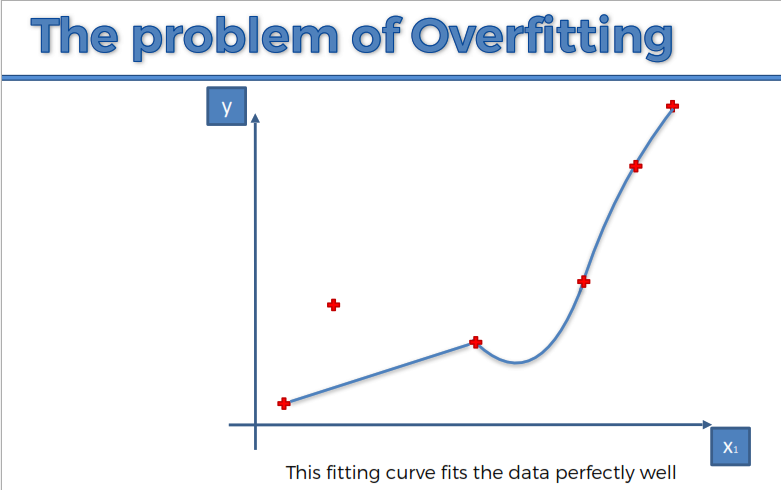  
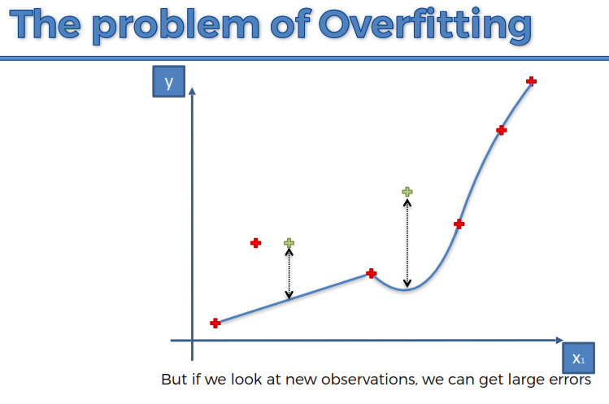  
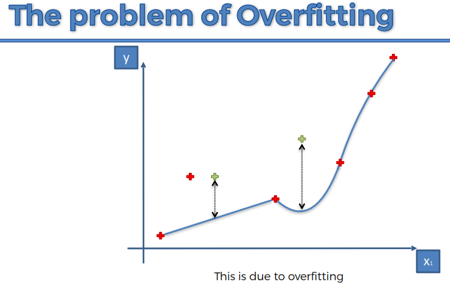  
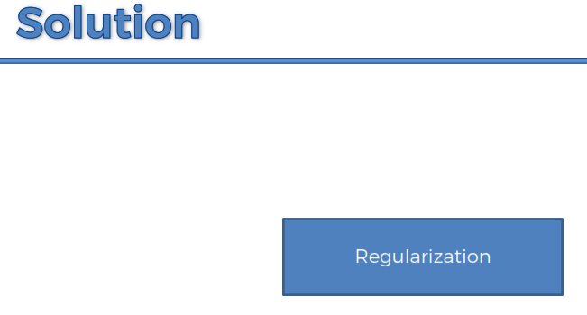  
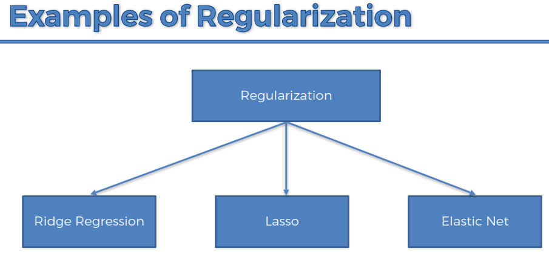  
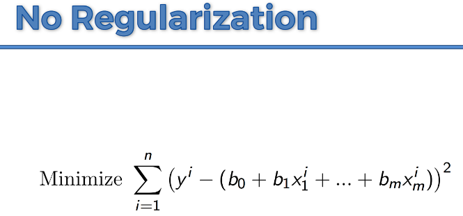  
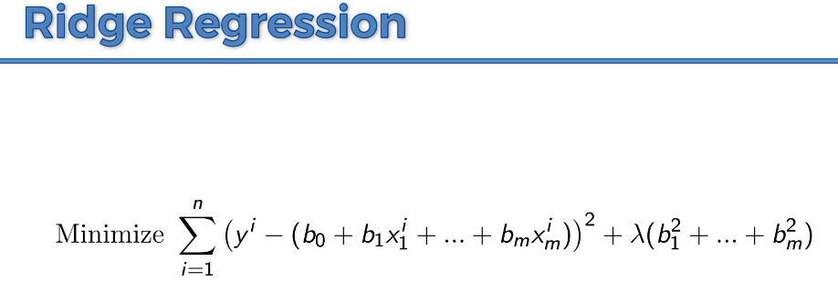  
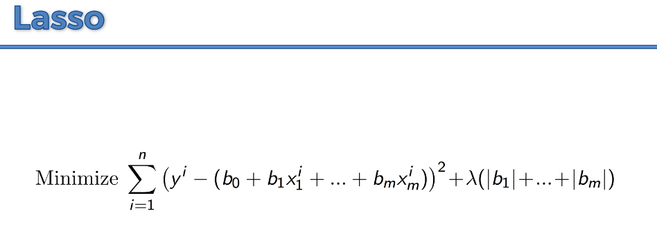  
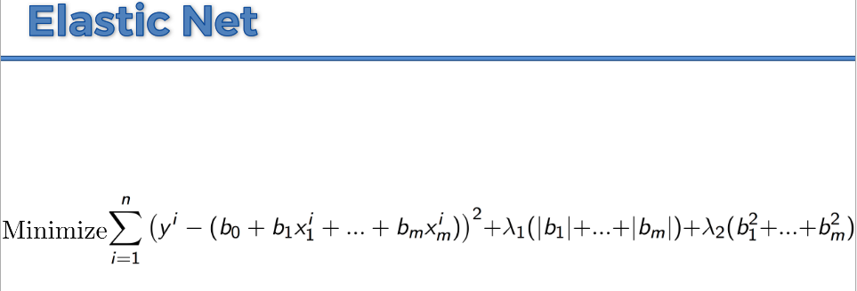  
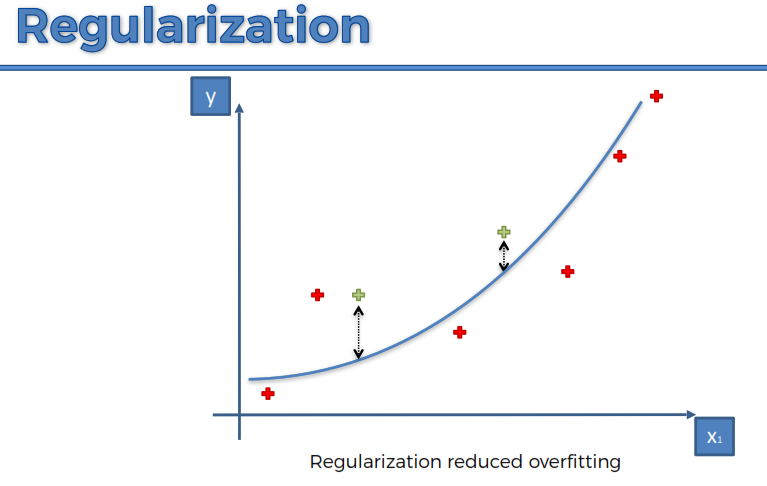

