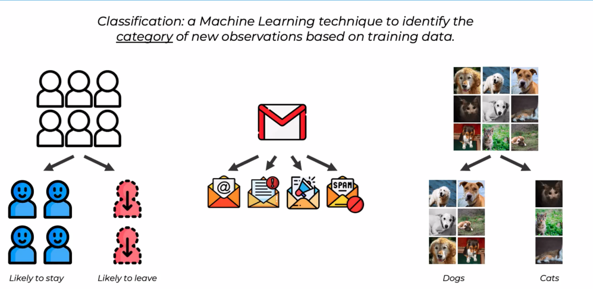
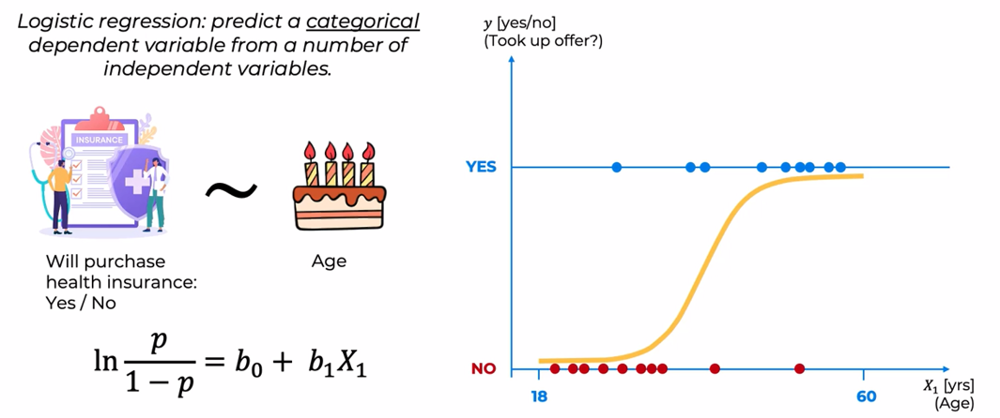
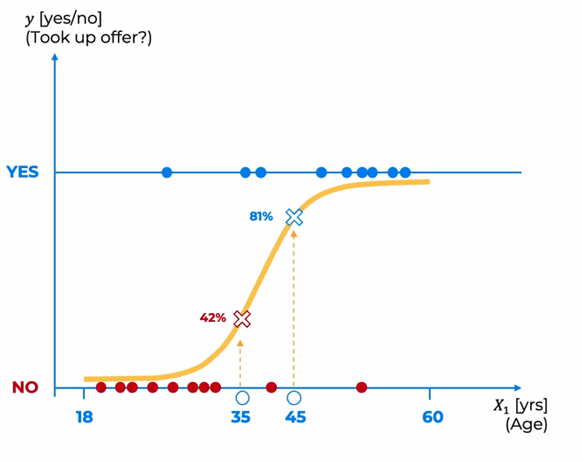
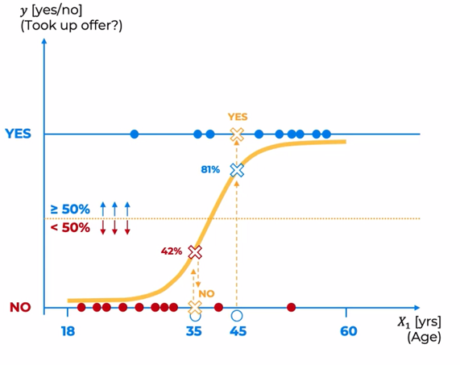
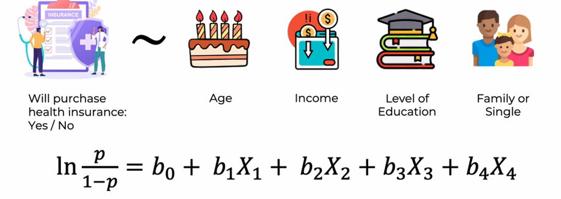
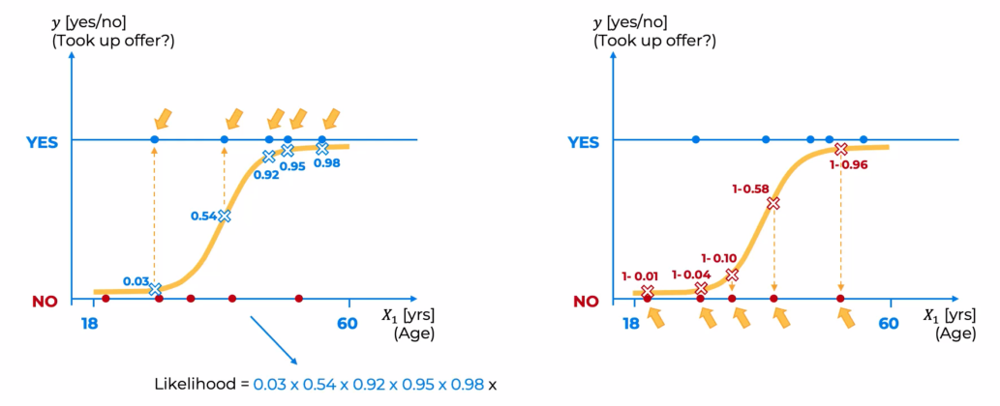
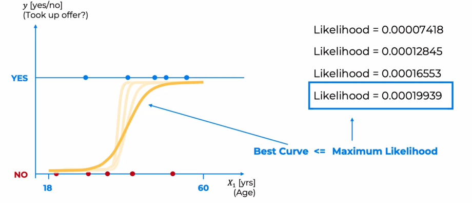

# What is Classification

&nbsp;&nbsp;&nbsp;Hello and welcome to this new section on classification. Classification is a very popular and important tool in the field of machine learning.  
Classification can thus be defined as a technique of machine learning for identifying the category of new observations based on training data. This differs from regression, where we had to predict a continuous number.

# Logistic Regression Intuition

&nbsp;&nbsp;&nbsp;The `logistic regression` is used to predict a `categorical dependent variable` from a number of independent variables. So, the key difference to a linear regression here is that we're not predicting a continuous variable, we're predicting a categorical variable.  
For example, you might be working for an insurance company and you want to predict will somebody purchase the health insurance that your company is offering, yes or no, and it's very simple, yes or no. It's a categorical variable. And you might want to be predicting this dependent variable based on an independent variable such as age. So, depending on their age, will they purchase the health insurance plan that your company is offering?  
So, on the x-axis, we would have age, and on the y-xis, we would have yes or no, did they take up the offer or not. Let's say our x-axis is somewhere between 18 years of age and 60 years of age, and our y-axis simply has binary outcomes, yes and no. So, there's no in between. It's either yes or no. So, we're going to just add this horizontal line for illustrative purposes.  
So, what will our data set look like?  
Let's say we've got certain number of observations in our dataset. So, we know people's age and we know when they were exposed to the offer, whether they purchased or didn't. So, these people over here didn't purchase the health insurance, and these people over here did purchase the health insurance, and that's our dataset. So, as you can see, it's very different. This plot looks very different to what we were working with in the linear regression tutorials. So, we can't simply draw a linear regression line, a sloped line through these points. It makes no sense. So, that's why the equation for logistic regression is slightly different.  
So, here on the left, we've got, instead of Y, we've got a logarithm. And then on the right, we've got the same part as we saw before. The important value to us here is p, and that is the probability that we will be working with just now. We'll see it in action. So, let's look at the logistic regression curve. The logistic regression curve looks like this, and it's also called the sigmoid curve.  
And how does this work in action? Well, let's say we have two new observations. Let's say we've built this model based on this data, we have a logistic regression.

&nbsp;&nbsp;&nbsp;How will it apply to new observations? Well, let's say we have two new observations, somebody of age 35 and somebody of age 45. What we do is we will need to project these values onto our logistic regression, find out where they fit there, and the logistic regression will give us probability. So, this value, everything here is between zero and one. So, no is a zero, yes is a one. And in between are the probabilities. So, the logistic regression gives us probabilities of somebody saying yes. So, somebody taking up that offer. So, for the 35-year-old, it's a 42% chance that they will take up the offer based on this model. So, this is what the model is predicting. It's predicting a 42% chance they will take up the offer, and for the 45-year-old, there's an 81% chance they will take up the offer. So, we could stop there. That is the p. That is the probability that we see in the equation on the left that's hidden inside that logarithm. So, we could stop there and we could use these probabilities and in some use cases that's what the logistic regression is used for. We just deal with the probabilities once we have them. But in most cases, we want a binary outcome, a yes or no outcome.

&nbsp;&nbsp;&nbsp;And so for those situations, we split our curve into two, our plot into two. Anything above this line, this middle line, anything above with a probability of 50% of higher will be projected into a yes, into a binary one. And anything below the 50% line will be projected into a no, a binary zero. Our points would end up here. So, based on this logistic regression we would make the conclusion that the 35-year-old would not purchase our insurance plan and the 45-year-old would purchase our insurance plan. 

&nbsp;&nbsp;&nbsp;And just like with linear regression, you can have multiple independent variables. So, for instance, age, income, level of education, how big their family is, or whether they have a family, or they're single. And many other types of variables can be added depending on the use case. And our equation will look like this in this situation. So, there you go. That's logistic regression in a nutshell.

# Maximum Likelihood

&nbsp;&nbsp;&nbsp;So, we have this curve that's fitting out data, it's great, but how do we know that this is the best curve that can fit our data? Just like with linear regression, there could be multiple curves of this shape that could fit our data. So, how do we find out which one is the best one? Well, we need to calculate the maximum likelihood, and the way it's done is by looking at each data point.  
So, for example, we start here, and finding out for the person of that age, what would've this curve that we are potentially considering, what prediction would've it made? So, this specific curve, this specific logistic regression that we've modeled, it would've said that a person of that age has only a 3% chance of saying yes or taking up the offer. So, it's a very low chance for this person or the person of this age to take up the offer. And then we would continue. So, for the next point, what would have the logistic regression modeled? So, we know that this person took up the offer. We know it's a yes because that's our input data, but what would have the logistic regression said if we didn't know that the person took up the offer, and the logistic regression, the point would be somewhere here on the curve, and that would be 54% chance. For this person or for this data point it would be 92%. For this data point, 95%. For this data point, our logistic regression for that specific age, a person of that age predicts 98%. So, we've got all those numbers. Great, now, just to make, to avoid cluttering this image, we'll do the bottom points on a separate image. So, for this point the logistic regression predicts a 1% chance. For this point, for somebody of that age, the logistic regression predicts a 4% chance. For the someone of that age, a 10% chance. For someone of that age, a 58% chance, and for someone of the age, a 96% chance. But remember on the right side over here, with the nose, the values that we've illustrated, 1%, 4%, 10%, 58%, and 96%, those are the probabilities of somebody saying yes, taking up the offer. So, the probabilities of them saying no are one minus that value. So, let's add that in there. So, one minus each one of those values is the probability of them saying no. So, for example, for the first point, it is actually a 99% chance. The logistic regression is predicting that someone of that age, there's a 99% chance that they will say no to the offer. And now we need to calculate likelihood. Likelihood is calculated by simply multiplying all these numbers. So, on the blue side, we multiply these numbers. On the red side, we multiply these numbers. And we get our value for likelihood.

&nbsp;&nbsp;&nbsp;And then the way to find the best fitting curve is to look through all possible sorts of curves. Of course, there's a more sophisticated process behind this, but, in a nutshell, you compare what the likelihoods are of different curves. So, let's say our logistic reaction modeling process started with this curve and calculated the likelihood to be this value. Then it went on to the next curve, and it calculated the likelihood to be this value. Then the next curve, the likelihood was this. And through this iterative process, it found the curve with a maximum likelihood. So, this would be the maximum likelihood of all the curves. And that means this is the best curve. And that's how maximum likelihood is calculated. And that's how the best fitting curve of logistic regression is found.

# Logistic Regression in Python

  
  
  
  
  
  
  
  
  
  

