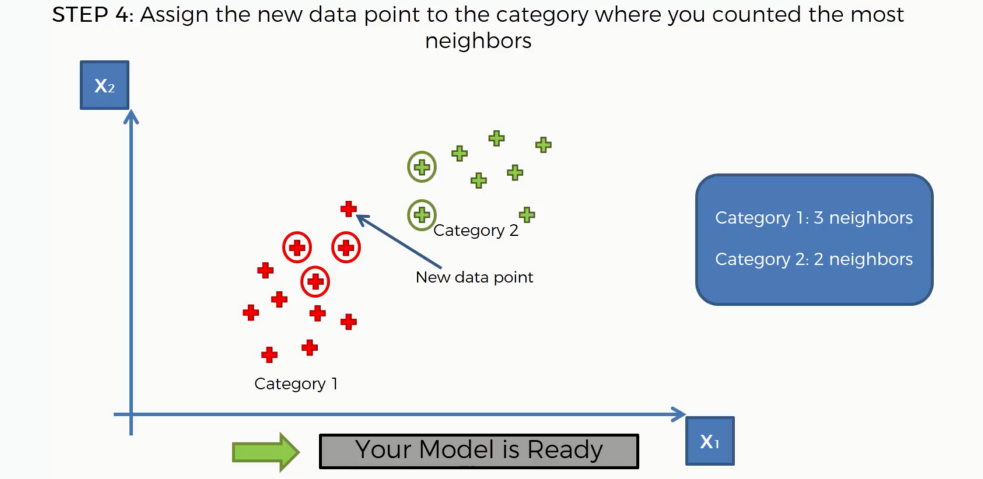

# KNearest Neighbor Intuition

&nbsp;&nbsp;&nbsp;So let's imagine that we have a scenario where we have two categories already present in our data set so we've identified two categories and one is category one on the left which is red, category two is green on the right. And for simplicity we're just going to take into consideration two variables or two columns in our data set so all of this grouping is happening based on these two columns x1 and x2.

&nbsp;&nbsp;&nbsp;And now let's say we add a new data point into our data set. The question is :  should it fall into the red category or should fall to the green category?. How do we decide that. So how do we classify this new data point, do it classify As a Red data point or a green data point and that's where the `K_nearest neighbors` algorithm will come to assist us. At the end of performing this algorithm we'll be able to identify whether it's a red or green point and in this case the point turned out to be red.

&nbsp;&nbsp;&nbsp;So how does the `K_nearest neighbor` algorithm work. How did it do that.  
Well we're going to build a step by step rule guides to the `K_NN` and then and after we've built it we're going to actually perform it manually to see how it works. And as you'll see is a very very simple algorithm.  
All right so the first step is to choose a number k of neighbors that you're going to have in your algorithm so you go to you have to identify whether K is equal to 1 2 2 3 5 or some other number. And one of the most common default values for k is `5` and next is to take the `K_nearest neighbors` of the new data point according to their `Euclidean distance`. Now here you don't have to use `Euclidean distance` you can use other distances such as a `manhattan distance` or any other distances that you might be considering. But in most cases `Euclidean distance` is so we're to stick to those. So once you've taken the nearest neighbors among these K neighbors you need to count the number of data points in each category. So how many data points fell into one category to the other category and so on if you might even have more than two categories in your data set. So you just need to calculate how many fall into each category and then you need to assign the new data point to the category where you counted the most neighbors. As simple as that. That's why it's called `K_nearest neighbors`. And then your model is ready as it is it's a very simple algorithm and moral which is going to do a manual exercise right now to really solidify this knowledge.

&nbsp;&nbsp;&nbsp;So let's move onto that. So here we've got the new data point has been added to our scatterplot as we saw previously. How do we find the nearest neighbors of this new datapoint.

&nbsp;&nbsp;&nbsp;Well let's have a look at the `Euclidean distance` that we're going to use so quickly and distance is a very basic type of distance that we define in geometry it's the one we use in geometry. And basically if you have two points over here p1 and p2 then the distance between the two points is measured according to this formula. So x2 minus X1 the difference between the x coordinates and then squared plus the difference between the y coordinates squared and then you take a square root out of all that. And that is basically if you look at it this way it's a right angled triangle as suiting you to in. Cathedral's and you squaring it you take in other theaters and it's growing it's taking you adding them up you're taking a square root and that gives you the length of the high poisoner's. So there we go. That's how Euclidean distance work. Again you could use any type of distance but this is the geometrical distance and this is what we're going to stick to. So basically on a scatterplot a two dimensional kind of polygon just draw the lines and see what is closer.

&nbsp;&nbsp;&nbsp;So here on your data point how are going to identify which other closest five neighbors. So basically we just look at them and we see the distances here so we can see that's the closest one that's probably the second closest ONE-THIRD closest fourth closest fifth closest So let's outline those.
 

&nbsp;&nbsp;&nbsp;So now all we have to do is step three among these K neighbors count the number of data points in each category is in category 1 in the red when we have 3 neighbors in category 2 we have two neighbors. 

&nbsp;&nbsp;&nbsp;So therefore step 4 are assigned the new data point to the category where you counted the most neighbors. That means we need to assign it to the read category as simple as that. There we go. Now we have classified this new point and your model is ready. There we go. It's a it's a very straightforward algorithm.

# KNN in Python

  
  
  
  
  
  
  
  
  
  
  

