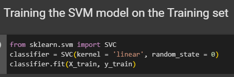

# SVM Intuition

&nbsp;&nbsp;&nbsp;All right so here we've got as usual points on a two dimensional space for simplicity's sake. We've got just two columns x1 and x2. And we've got some observations some already have agreed so we've already classified them but now how do we derive a line that's going to separate them. So how do we actually separate these points. Because that's a separation. Or in other words that decision boundary is going to be very important for us going forward when we start adding new points so that's that's the point of our classification. That's the purpose of openness because we want to create a boundary between these two so that when we in the future add new points that we want to classify that haven't been classified yet we will know where they will fall either in the greater green area or in the red area. So how can we separate these points we see here.

&nbsp;&nbsp;&nbsp;Well one way is to draw a line like that in our two dimensional space and then say anything to the right will be green anything to the left will be red and if a new point falls somewhere on this space we will know right away if it's red or green because we'll know where it falls. However there's another way we can draw a horizontal line like that or we can draw a diagonal line like that. We can actually draw another diagonal line or we can draw another diagonal. So there's lots of different lines that we can create that will achieve the same result they'll separate our points to two classes. But at the same time they all in the future will have different consequences so when we add new points depending on where that point will fall it'll either be classed as part of the Green Zone and part the Reds or we want to find the optimal line and that's what fields are all about. They're about finding the best line or the best decision boundary which will help us separate our space into classes. 

&nbsp;&nbsp;&nbsp;So let's find out how the SVM actually searches for this light. Well the line is searched through the maximum margin so here you can see a line and this is the line. And SVM would draw. And so basically it's the line that separates these two classes of points. And at the same time it has the maximum margin which means this distance so this line is drawn equidistant from this point and this point and we'll find out exactly why these points in a second. And then the distance between the line and each one of these points that's equidistant. And that's margin's So the sum of these two distances has to be maximized in order for this line to be the result of the SVM. And these two points are actually called the support vectors. Why they're called vectors was about an hour and a second. But so basically they these two points are supporting this whole algorithm. So even if you get rid of all the rest of the points that thing will change the algorithm will be exactly the same. So these other points they don't contribute to the result of the algorithm only these two points are contributing and therefore they called the supporting vectors you can call them supporting points but in reality they are vectors. And this is why because in a multi dimensional space when you have more than just two variables you can have three five 10 or 100 variables. Each point is actually no longer a point because you can't visualize it on a two dimensional plane or even a three dimensional space and therefore each of those points that we see here is considered is actually a vector in a multi dimensional space so the more general term for points that we see here are vectors and this is something that is studied in mathematics in university or high school mathematics and basically. So generally speaking they are all vectors just in this particular example and we have two dimensions then we can call them points but in reality there are pictures and that's why they're called support vectors. So hence these two specific vectors are the ones supporting kind of supporting this decision boundary or this way we're building this algorithm that's why they're important and that's why this whole algorithm is called the support vector machines. So now what else do we have here. Well we've got the line in the middle which is called the maximum margin hyperplane or the maximum margin classifier. So in a two dimensional space it's just like a classifier is just the line. But actually in a multidimensional space it's a hyperplane. And I know it's a very confusing term but that's what is called a maximum margin hyperbola. So those all of the ones that we saw were also hyperplane but there weren't the maximum margin hybrid blades and you can check that yourself so you can draw a different hyperplane here and just check out the marginal. It'll always be less because this is the one with the maximum margin. And then you've got the green and the red dotted lines. So the green one is called the positive hyperplane and the red was called the negative hyperplane. It doesn't really matter in which order you name them just the point is that one of them is positive and negative or basically anything to the right of the positive is classified as the green category or the positive category anything to the left to classify as a negative category or the red category in our case. So that's how the supervision machine algorithm works of course there's some complicated mathematics behind it but the essence of the intuitive part of it is exactly this that we're working with a linearly separable data set where we can actually it's given to us by default that we can put a line through a chart which will separate the two categories and then we're just searching for the one with the maximum margin. So conceptually when you think about it it's actually a pretty simple algorithm when you think about it this way If I were going into the mathematics.

&nbsp;&nbsp;&nbsp;And the question is what's so special about SVM is why are they so popular and why are they different to other machine learning algorithms and that's exactly what we're going to talk about right now. So imagine you're trying to teach a machine how to distinguish between apples and oranges how to classify a fruit into either an apple an orange. So you're telling a machine that. All right I'm going to give you some test data so have a look at all of these apples. These are apples oranges. Analyze them. Look at them see what parameters they have and then next time they're going to give you. I'm going to give you a fruit which will be either an apple an orange and you're going to need to classify it and tell me whether it's an apple or an orange. Right. So that's kind of a standard machine learning problem.

&nbsp;&nbsp;&nbsp;Now in our case here you can see let's say on the right we have oranges on the left we have apples. So what predominately machine algorithms would do is they would look at the most Apple  the apples and the most orange the orange so they would look at the most stock standard common type of apples and the most stock standard common type of oranges and now case would be Apple some more there in that in the very heart of the apple class far away from the oranges. And for the oranges would be somewhere over there. So also in the very heart of the orange class far away from the Apple so they were tried. A machine would try to learn from the apples that are very like apples so it would know what an apple is. And it also tried to learn from oranges so it would know what an orange actually is and that's how most of the machine learning algorithms work and then based on that it would be able to come up with some predictions and classifying four new data elements and variables that you would get it in the case of support vector machine. It's a bit different. 

&nbsp;&nbsp;&nbsp;Instead of looking at the most stocks standard apples and stocks and oranges what this support victualling machines do is they actually look at the apples that are very much like an orange so here you can see an apple which is not your standard Apple is orange and color right. So it's very easy to infuse this apple of an orange and they would look at oranges which are not stock standard oranges which are more like apples than anything else so you can order the Lemon here. So those of us in the image just out of the oranges the SVM would pick the one that is that looks the most like an apple in this case. We have a green orange. It's not normal to have a green orange when you think of orange you think of orange orange. And so what that is is. Those are the support the support vectors so the support vectors you can see that they're actually very close to the boundary so they're very close to the apple or the red one would be very close to the green ones and the orange or the green mark here would be very close to the red ones and therefore the support vector machine in that sense you can think of it is like a more extreme type of algorithm a very rebellious type of algorithm a very risky type of algorithm because it looks at a very extreme case which is very close to the boundary and it uses that to construct its analysis. And that in itself makes the support vector machine algorithms very special very different to most of the other machine learning algorithms. And that's why at times they perform much better than non-supported of vector machine algorithms. So there you go I hope this explanation and intuition of support vector machines was useful and now not only you know how they work but also why they are different to other algorithms out there that are used in machine learning. And on that note we're going to enter this material.

# SVM in Python

  
  
  
  
  
  
  
  
  
  
  

