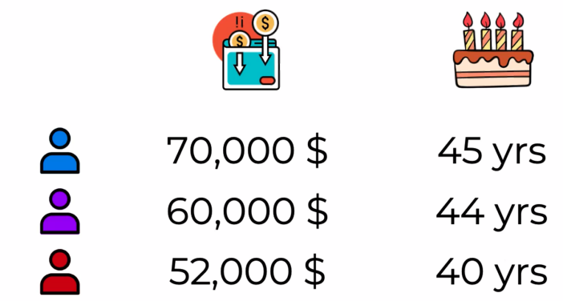
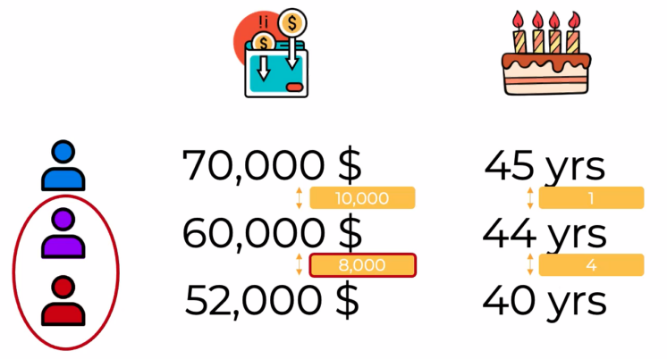
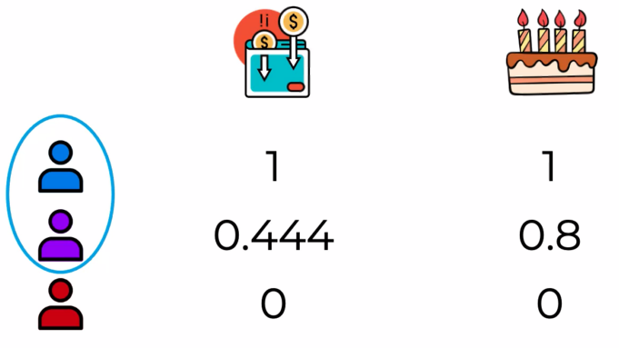

# The Machine Learning process

&nbsp;&nbsp;&nbsp;Today, we are talking about the machine learning process. As you will see from the practical tutorials of this course, there is a specific step-by-step process that we typically always follow when building machine learning models.

&nbsp;&nbsp;&nbsp;This process has three main steps :  

# Splitting the data into a Training and Test set  

&nbsp;&nbsp;&nbsp;Let's imagine that you are tasked to predict the sale prices of cars, and that is your dependent variable. And your independent variables are the mileage of the car and its age. And in your data that are supplied to you you have 20 cars in total.  
So what splitting your data implies is separating a part of your data out before you do anything. And usually that's about 20% of the data. So since we have 20 cars here that's about four cars that we separate out. So what that means is that the bulk of our data 80% will be our training set and the separated 20% will be our test set. We'll use our training set to build the model.  
&nbsp;&nbsp;&nbsp;So in this case we're building a linear regression and then we will take the cars from the test set we will apply our model to them. So they haven't been part of the model creation process. The model has no information about these cars. And now we're applying this model to them. And it's predicting certain values, certain prices. But the good news is that because this is something we separated in advance as part of the data that was given to us we actually know the actual prices. So now we can compare the predicted values which were generated using a model that has never seen these cars before, and we can compare that to the actual values that we know what these cars sold for.  
&nbsp;&nbsp;&nbsp;And so from that we can evaluate our model. Is it doing a good job? Is it doing a not so good job? And do we need to improve it?  

# Feature Scaling

&nbsp;&nbsp;&nbsp;please remember that feature scaling is always applied to columns. Feature scaling is never applied across columns, so you wouldn't apply feature scaling to data inside a row.  
So there are multiple types of feature scaling, multiple techniques. We're going to look at the two main ones :   
normalization and standardization.  
&nbsp;&nbsp;&nbsp;Normalization is the process of taking the minimum inside a column, subtracting that minimum from every single value inside that column, and then dividing by the difference between the maximum and the minimum. So basically, every single value in a column is adjusted this way and you will end up with a new column or an adjusted column with values which are all between 0 and 1.  
&nbsp;&nbsp;&nbsp;Standardization, on the other hand, the process is similar, but instead of subtracting the minimum, we subtract the average, and we divide by the standard deviation. As a result, all of the values, or almost all of the values inside the column will be between -3 and 3.

&nbsp;&nbsp;&nbsp;So let's imagine we have a data set where we have two columns, annual income of a person and their age. Just simple data with those two columns. We're going to have a blue person, a purple person, and a red person.  
The task at hand is to see which of the two people to the purple person is most similar to just based on this data. 

  

&nbsp;&nbsp;&nbsp;So let's look at the differences. Now what can happen with unscaled features as we see here, is that the values, the unit values of one column can be so much larger than the unit values of the other that it might overpower.  
Now we don't want this or similar things happening in our algorithms, and that's why we need to normalize variables because we can't compare. These are non-comparable things.  

  

&nbsp;&nbsp;&nbsp;So it's important to scale your features. And so let's apply normalization. So we're going to apply it to the columns one by one.  

