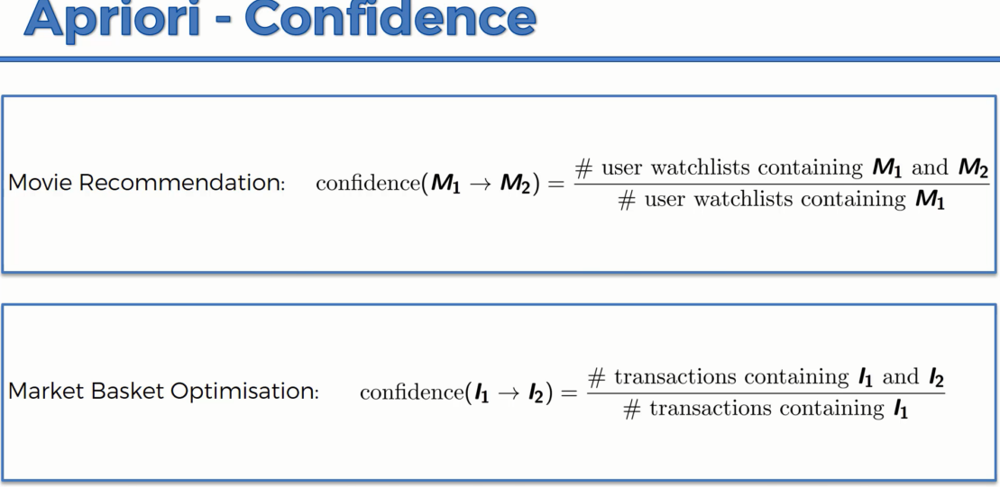
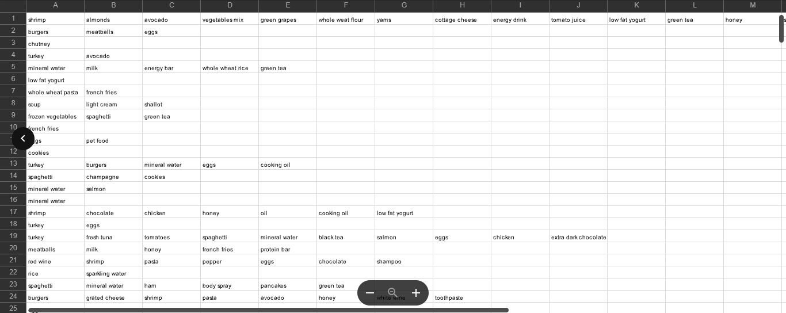
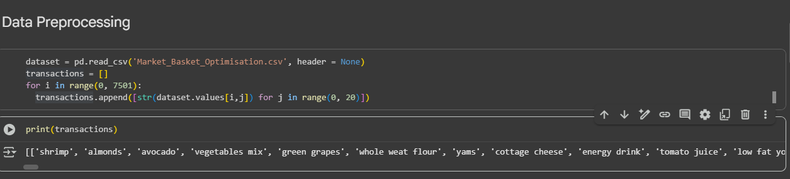

# Apriori Intuition

&nbsp;&nbsp;&nbsp;And we're gonna get started by talking about a story. It's a somewhat legend of data science or a legend that is quite well known in data science. You may have heard of this legend. It's not a myth, it actually happened, but as you know things when they happen a long time ago and then time passes and the facts get distorted. But I'll tell you my story of this legend and it might not be exactly correct, but this is how I know about and how I've heard about it. So, what do you think the commonality is between these two products, Pampers or diapers, and beer? What do you think they have in common and why are they part of this urban legend now? Why are they part of this data science legend? Well, as the story goes, a company, we are not going to name the company, but a company that is actually like a convenience store did some analytics around the products that people are purchasing. And so they were looking at what people are checking out with, what are the commonalities? And they analyze thousands and thousands and thousands of transactions. So thousands of people who actually checked out, if not tens of thousands. And they found a very interesting thing that very often during certain times of the day when people shop in the afternoon between six and 9 p.m. people who buy diapers also buy beer. And it was out of the blue, completely out of the blue  
why these two products are completely not connected. Why would somebody buy beer when they're buying diapers or why buy diapers when they're buying beer. So that was the fact that they came across in the data and the explanation to this fact, one of the plausible explanations is that in the afternoons or in the evenings when the husband gets home and their, like him, the husband and the wife are taking care of the their baby they sometimes find that they run out of diapers and who has to go pick up the diapers? Well, the husband has to go pick up the diapers. Or the wife sends the husband to go pick up the diapers and while he's picking up the diapers, 'cause it's already after hours after work, he also, he's already in the convenience store, he also picks up some beer, right? And so that is a plausible explanation. Might be the case, might not be the case, but it sounds pretty reasonable. And based on that, so that's something that you can't really think of just by yourself, but that comes from the data. And based on that you can decide how to to arrange products in your store.  
So some stores might decide to put these two products closer to entice people to buy a beer when they're buying diapers. But actually a lot of stores do the opposite. There are a lot of stores separate beer and diapers, just like they try to separate and you'll probably notice this from your convenience store that they try to separate bread and milk as far as possible. Why? Because that way they already know that these two products are bought together. And so you actually have to walk through the whole store to pick up, you've picked up your bread, and then to get to the milk you have to get all the way through the whole store to the completely opposite corner of the store. So as you're walking through the store, you see more other products and you're more likely to pick up an additional item that you weren't actually planning on buying when you got to the store in the first place. So there's a lot of interesting marketing tactics that are used based on this data, but the question is how do you get to this data?  
And one of the ways to get to it is the Apriori algorithm. So let's talk about Apriori in a bit more detail now.

&nbsp;&nbsp;&nbsp;All right, so Apriori is about people who bought something also bought something else, or who watched something also watched something else, or who did something also did something else. So it analyzes and this whole association rule learning part of the course is all about analyzing when things come in pairs or in triplicates or in... Not in sequence, but they are combined together for some reason looking for those rules and those ways that this happens.

&nbsp;&nbsp;&nbsp;All right, so let's have a look. For instance, movie recommendation, right? So you've got user IDs, you've got movies that the people liked, movie one, two, three, four, movie one and two for the second person, and so on. And from here, just by looking at it, even without not knowing anything about association rule learning or the Apriori algorithm, you can already tell that there are some potential rules that can come out of this, that for instance, everybody who watches movie one, not everybody, but it is likely that people who watch movie one, will... Or who like movie one, will also like movie number two. And people who like movie number two are quite likely to also like movie number four. And people who like movie number one are also quite likely to like movie number three. So there you can come up with lots of different potential rules, but some are gonna be stronger, some are gonna be weaker and we want to find the very strong ones in order to build our business decisions or our other decisions on those rules that we can see in the data, we don't have to go and ask people, "Hey, do you like movie number one? "And would you like movie number two? "Because of that, do you like moving number two?" Or, "What is your taste and preference?" We can see these things from the data and we wanna extract this information and as long as we have a large enough sample size, if it's not just like five people, if it's 50,000 or 500,000 people that we're analyzing, we can come up with some quite solid rules.

&nbsp;&nbsp;&nbsp;All right, so here's another example where we've got a market basket. So example of people who buy not just groceries, but this is more kind of like a a restaurant or a takeaway place. And here you can see there's a link obviously, between burgers and french fries, interesting vegetables and fruits, and people are trying to be healthy, burgers french fries and ketchup. So again, these are potential rules, not necessarily the ones that we're gonna take away from data. This is just an example of something that you might observe visually just by looking at this data set. 

&nbsp;&nbsp;&nbsp;All right, so how does the Apriori algorithm work? Well, the Apriori algorithm has three parts to it.  
Its got the `support`, the `confidence`, and the `lift`.  
So we're gonna start off with the support and you will see that it's very similar to something we've already discussed. It's very similar to the way we talked about the intuition for the Bayesian, for the naive Bayes classifiers. So let's have a look here, we've got movie recommendations. Support for movie M is... The number is defined as a number of users who watched movie M divided by the total number of users. And market basket optimization, the same thing. Number of transactions containing certain item, I, divided by the total number of transactions.

&nbsp;&nbsp;&nbsp;Let's have a look at an illustration.  
Here we've got a hundred people, so we've got five rows and 20 columns of human beings. And let's see how many of them, let's say we're talking about a movie and I'm gonna give an example of one of my favorite movies "Ex Machina." And if you haven't seen it, definitely check it out. It's all about AI and machine learning. So let's say, let's see how many of these people have actually seen "Ex Machina?" So there we go, there's 10 people who have seen "Ex Machina." Right, out of a hundred, so what does that mean?  
That means our support here is 10%.

&nbsp;&nbsp;&nbsp;Good. Okay, now let's move on to step two. Step two is we need to find the confidence. What is the confidence? Well, confidence is defined as the number, let's go for movies, So the number of people who have seen movies, M1 and M2 divided by the number of people have seen movie M1. So here we're going to assume that we're testing a rule, we're testing a rule that let's say people who have seen "Interstellar," where we have a hypothesis that says, that people who have seen "Interstellar" they are also or have liked "Interstellar" are also likely to like "Ex Machina" or let's even go, who've seen... People who have seen "Interstellar" are also likely to have seen "Ex Machina." So basically here, movie number one, M1 is going to be the "Interstellar" movie, the one that we're saying, "Okay, so we're gonna take everybody who's seen "Interstellar" and we're gonna check how many of them have seen "Ex Machina" and that's exactly what we're doing here. And market basket optimization, same thing, you can think of an example of french fries and burgers. For instance, people have had burgers, who've ordered burgers also likely to order french fries. So at the top you would have people have ordered burgers and french fries, and the at the bottom you'll have people who have ordered burgers only, well, who have ordered burgers regardless of whether they've ordered french fries or not.

&nbsp;&nbsp;&nbsp;Much easier to talk about this with an illustration. Let's say those people colored in green are the ones who have seen "Interstellar" who have watched this movie. Now we want to know, not out of our whole population, but out of just those people who have seen "Interstellar" how many of them have seen "Ex Machina?" So out of them we have seven people who have also seen "Ex Machina." So there's only seven people who have seen both movies. That's what we're after. And so our confidence is going to be seven divided by 40. Just by definition, this is how it's calculated, 40 people have seen "Interstellar" and seven people out of those 40 have actually also seen "Ex Machina."So the conference here is 17.5%, good.

&nbsp;&nbsp;&nbsp;And the next part or the third and last step is the lift. And what is the lift? Lift is very simple again, is gonna be very similar to what we had in the naive Bayes, naive Bayesian classifiers in that algorithm when we were discussing it. So the lift is basically the confidence divided by the support. So what we calculated in step two divided by what we calculated in step one, and let's just talk about it in the illustration, because it's gonna make way more sense that way. 

&nbsp;&nbsp;&nbsp;So here's our population, those people in green are the ones who have seen "Interstellar," and all of these people in red are the ones who have seen "Ex Machina." So basically our lift is all right, so if we just randomly suggest to a person to watch "Ex Machina," what is the likelihood that it's a movie for them? It's a movie that, not in this population, like out of the out of this population, we know that out of 100 people only 10 actually watch "Ex Machina" and we're going to assume that watched and liked are interchangeable terms here. So we're going to assume that if they didn't watch it they're not gonna like it anyway. So if we take another random population and then what is the likelihood that if we recommend to a random person in that population that brand new population, we recommend that the "Ex Machina" movie, what is the likelihood that they will like it? Well, the likelihood is 10%, because out of a hundred people only 10 of them actually liked that movie. But now the question is, can we prove that result by using some prior knowledge? That's why the algorithm is called Apriori. In that new population, let's only recommend "Ex Machina" to people who have already seen "Interstellar" to people who are marked as green in this population. So we'll only ask, "Have you seen Interstellar?" If they have, then we'll recommend "Ex Machina." What is the likelihood that a person will actually like "Ex Machina," if we recommend them that way? Well in that case, the likelihood as we've calculated out of the green people only, not only, out of the green people 17 and a half percent actually liked "Ex Machina." So the lift is the improvement in your prediction. So your your original prediction's 10%, if you just randomly take a person out of your new population and recommend "Ex Machina" they'll like it for the likelihood of 10%. If you first ask the question, have you seen and liked "Interstellar?" If they say, yes, and then you recommend "Ex Machina" the likelihood of a successful recommendation there is 17.5%. So the lift is by definition 1.75. There we go, that is what the lift is defined as. And that's pretty much the whole Apriori algorithm. 

&nbsp;&nbsp;&nbsp;That's the steps that it involves. And now we're just going to put it all together in this one kind of step by step process. So step one, you need to set up a minimum support and confidence. So you might want to only... Because there's so many different recommendations. We only looked at one example, one specific example to simplify things, we talked about "Ex Machina" and "Interstellar." But as you could see in the examples before that you could have like a hundred different movies and the different combinations, like Apriori is actually quite a slow algorithm, because it just goes through all of these different algorithm or all of these different combinations. So it says, what if movie one is a good recommendation for movie two or movie one means that person will like movie two, movie one means a person will like movie three, and movie one, movie four, and then it actually combines more. It says movie one and movie two might mean that person will like movie three and so on. So it actually combines lots and lots and lots of not just pairs, not triplets, it combines four, five, six, seven items in one set and so on. And yeah, so it gets quite big and therefore you need to set some kind of limitations. So you need to set a minimum support. For instance, you might not want to look at products that have a support of less than 20%. You might not even want to consider them, because you don't want to waste your time building a model for something that only has a success rate of 20% on its own. Or you might limit it at 5%. Then you might want to also limit a confidence. So in our example, the confidence was 17.5%, that somebody who liked one movie will like the other one. Maybe you might want to limit it at anything less than 12%. You don't want to look at it, because it's not as strong enough factor for you, it's not a strong enough rule for you, because there is going to be so many different rules on the output of this algorithm. You already know that you'll have much stronger ones. So you don't want to consider anything that's less than 12%, or 20%, or whatever percentage you decide to set in that specific scenario. Then once you've set those, then you take all the subsets in transactions having higher support than minimum support, take all the rules of the subset having higher confidence than minimum confidence, basically apply those two minimums that you've set, and then at the end of course, you sort the rules by the decreasing lift. So that's where the lift comes in. The rule with the highest lift given these criteria is going to be the strongest rule and that's the one you might want to look into first. Something like, I don't know, if a person buys a burger and french fries then they're likely to buy tomato sauce or ketchup as well. And sometimes it makes sense, because you need ketchup to... A lot of people like to eat ketchup with their burgers and french fries. So basically, you find the ones with the highest lift and those are the ones on your top 10 or top five and those are the ones that you consider for actually implementing a business decision and basing it on them. So that's pretty much how the Apriori algorithm works. It was quite a long story, I thought we had some good fun here. There was another example that I wanted to share with you. Oh, okay, so just wanted to mention that recommender systems, things like, companies, like, Amazon use and others and Netflix and so on, they would be they would be a good example for using Apriori. Apriori would be good there, but of course, they are much more sophisticated. They're not just Apriori, they actually use combinations or very specific or specifically designed algorithms. So I just don't want you to be confused that Apriori, that means that everything uses a Apriori. Apriori is just a basic kind of straightforward approach to solving this problem, and it's a good example of how it can be done, but of course, there are other ways of doing it. And for instance, we'll look at some of the methods, and in fact, some of the methods that we already use can be used to build recommender systems as well. All right, so on that note, thank you for your attention, and off we go to Hedlund to look at how we can code Apriori in Python. And I'll see you here next time. Until then, happy analyzing.

# Apriori in Python

