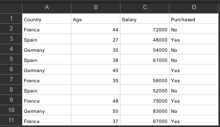
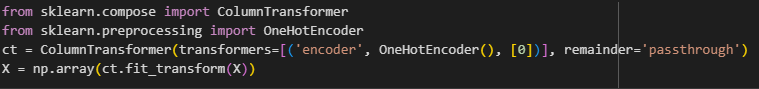
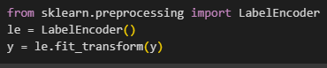

# Importing the Libraries

&nbsp;&nbsp;&nbsp;We're gonna import three libraries now, which are `NumPy`, `matplotlib`, and `pandas`.  
NumPy will allow us to work with arrays because indeed you will see that your future machinery models will expect some arrays as input, and therefore, we need the library to work with these arrays, and that's NumPy.  
Then we'll import matplotlib, which is the library that will allow us to plot some very nice charts.  
And finally, pandas, which Will allow us to not only import the dataset, but also create the matrix of features and the dependent variable vector.  

> import&nbsp;&nbsp;&nbsp;`library name`&nbsp;&nbsp;&nbsp; as &nbsp;&nbsp;&nbsp;`shortcut[optional]`  

# Importing the Dataset

&nbsp;&nbsp;&nbsp;We're gonna learn how to import the following data set, 'data.csv', which is a very simple data set of, let's say, a retail company that is doing some analysis on which clients purchased one of their products. So, the rows in this dataset correspond to different customers of this employee. And for each of these customers, we have the country they live in, their age, their salary, and whether or not they purchased the product.  

&nbsp;&nbsp;&nbsp;So, the first thing we have to do is to create a new variable. And this variable will contain exactly the dataset. It will be equal to the output of a certain function by Pandas. And this certain function will exactly read all the values of this dataset and will create what we call a data frame. So, it will create a data frame and it will contain exactly the same rows and columns and values as what you see here. And this data frame will be exactly this dataset variable.  
&nbsp;&nbsp;&nbsp;we're gonna call a certain function by the Pandas library, which is called `read_csv`. And in this function, we will only have to input the name of the data set with the extension.  

&nbsp;&nbsp;&nbsp;So, I'm gonna give you now a very first important principle in machine learning. In any data set with which you're gonna train a machine learning model, you have the same entities, which are the `features` and the `dependent variable` vector. Very simply, the `features` are the columns with which you are going to ***predict*** the `dependent variable`. And the `dependent variable`, of course, is the last column because, you know, this company would like to predict if some future customers are going to purchase a certain product based on these information.  
&nbsp;&nbsp;&nbsp;So, very simply, the features, or also called the independent variables, are the variables containing some information with which you can predict what you want to predict, which is called the dependent variable.  

>dataset = pd.read_csv('`dataset name`')  

And we are gonna call them 'x' for the matrix of features and 'y' for the dependent variable vector.

&nbsp;&nbsp;&nbsp;In order to create X, well, we simply have to take the three first columns of this data set.  
First, what you're gonna do is take your data set, that exact same variable which you created in this first line of code 'dataset'. Then from this data set, and I'm adding a dot here because we're about to use a function, one of the attribute functions of a Pandas data frame and that function is `ilock`. `ilock` here stands for `locate indexes` and therefore what this function will do is it will take the indexes of the columns we want to extract from the data set. Not only the indexes of the columns but also the indexes of the rows.  

&nbsp;&nbsp;&nbsp;And now let's do the same for our dependent variable vector. And you know this will be exactly the same. We'll just have to change one little thing.  

# Taking care of Missing Data

&nbsp;&nbsp;&nbsp;If we have a look again at our dataset, we notice that there is a missing salary here for this specific customer from Germany of 40 years old, and who purchased the product. So, generally you don't want to have any missing data in your data set, for the simple reason that it can cause some errors when training your machine learning model, and therefore you must handle them.  
&nbsp;&nbsp;&nbsp;There are actually several ways to handle them,  
a first way is to just ignore the observation by deleting it. That's one method, and this actually works if you have a large data set, if you have only 1% missing data, you know removing 1% of the observations won't change much the learning quality of your model.   
And now a second way, and this is what we're adding right now in the toolkit, is to actually replace the missing data, by the average of all the values in the column, in which the data is missing. This is a classic way of handling missing data.  
&nbsp;&nbsp;&nbsp;So to do this, we're gonna use the `scikit-learn` libraries. `scikit-learn` is an amazing data science libraries containing a lot of tools, including a lot of data preprocessing tools. To handle missing data, and to do this the class that we're gonna use from `scikit-learn` is called `SimpleImputer`.

&nbsp;&nbsp;&nbsp;This object will allow us to exactly replace this missing salary here, by the average of the salaries, and then we will have an updated data set, you know, an updated actually matrix of features, because we will apply this imputer on the matrix of features only, so we'll have a new matrix of features with no missing data,  
&nbsp;&nbsp;&nbsp;for the arguments, first, we have to specify which missing values we have to replace. And so that's why we have to enter here first argument called `missing_values`, which has to be equal to `np.nan`, and that's just to say that we want to replace all the missing value in the data set, and then the second argument we have to input is `strategy` and this argument will be equal to, in quote, `mean`.

&nbsp;&nbsp;&nbsp;We haven't connected anything yet to our matrix of features. So the next step is indeed to apply this `imputer` object on the matrix of features. The `fit` method will exactly connect this `imputer` to the matrix of features. In other words, what this fit method will do is it will look at the missing values in, and also it will compute the average of values.  
&nbsp;&nbsp;&nbsp;And then that will not be enough to do the replacement we want. To do the replacement we'll have to call another method called `transform` and which will this time apply the transformation. meaning it will replace the missing values by the average of values.  

# Encoding Categorical Data

&nbsp;&nbsp;&nbsp;So first let me explain why we have to do this. Let's open the data set again. And as we can see, this data set contains one column with categories, you know, France, Spain, or Germany. First, you might guess that it'll be difficult for machine learning model to compute some correlations between these columns, you know, the features and the outcome, which is the dependent variable. And therefore, of course we'll have to turn these strings, you know, these categories into numbers.  
So one idea would be to encode France into zero, Spain into one, and Germany into two. However, if we do this, our future machinery model could understand that because there is a numerical order between these three countries and mostly it could interpret that this order matters. There is not a relationship order between these three countries, France, Germany, and Spain. So we want to avoid the model to have such an interpretation because that could cause some misinterpreted correlations between the features and the outcome which we want to predict. Therefore, we can actually do much better than just encode these three countries into zero, one, and two. And this thing that we can do better is actually one hot encoding and `one hot encoding` consists of turning this country column into three columns. And `one hot encoding` consists of creating binary vectors for each of the countries.  
So very simply, France would, for example have the vector 1 0 0. Spain would have the vector 0 1 0 and Germany would have the vector 0 0 1. So that then there is not a numerical order between the three countries because instead of having zero, one, and two, we would only have zeros and ones. We're basically going to replace this country column by three new columns containing the zeros and ones and coding each of the countries. That is called `one hot encoding` and that is a very useful and popular method to use when pre-processing your data sets containing categorical variables.  
&nbsp;&nbsp;&nbsp;And then, remember that there is also this purchased columns that has labels, you know, non-numerical values with yes and nos. And we will actually have to replace them by zeros and ones. And that's totally fine for the dependent variable as long as it is a binary outcome, it is super fine. It will actually not compromise the future accuracy of the model if you just replace no and yes by zero and one.

&nbsp;&nbsp;&nbsp;The first step is to create an object of the column transformer class and therefore we're gonna create a new variable here which I'm gonna call CT, which stands for, you know the object of the column transformer class.  
So CT equals `ColumnTransformer` class and it takes two arguments. So these two arguments are first `transformers`, where we will specify, what kind of transformation we want to do and on which indexes of the columns we want to transform.  
And the second argument is `remainder` which will specify that we actually want to keep the columns that won't be applied some transformations.  
&nbsp;&nbsp;&nbsp;So for the first one, `transformers` we actually have to specify three things.  
First, the kind of transformation which is encoding.  
Second, what kind of encoding we want to do which is, one hot encoding.  
And third, the indexes of the columns we want to encode  
So we have to actually input all that, in a pair of square brackets and then some parenthesis. The first element is, as we said, the kind of transformation. And to specify that we want to do some encoding transformation, we have to enter here in quotes `encoder`.  
&nbsp;&nbsp;&nbsp;And now the second one, `remainder`. So here we want to specify in quote the following code name, which is `passthrough`, and which is a code name that will say that we indeed want to keep the columns that won't be applied some transformation that won't be one hot encoded.  

&nbsp;&nbsp;&nbsp;Now we have our CT object. It is of course not connected yet to our matrix features X. And so that's exactly what we want to do. Our `ColumnTransformer` class actually has a method called `fit_transform` which will do exactly the process of fitting and transforming at once at the same time.  
&nbsp;&nbsp;&nbsp;*The `fit_transfer` method actually doesn't return the output as a NumPy array. And it is absolutely compulsory to have X as NumPy array, because this will be expected by the future machinery models which we're gonna build. So here we want to force the output of this fit transfer method to be a NumPy array.

&nbsp;&nbsp;&nbsp;Now we're gonna quickly do another encoding for the `dependent variable` because indeed it has a text format. We would just like to convert these strings into zero and one respectively. And to do this, well that's very simple we're gonna use another class called `LabelEncoder` and which will exactly encode these no's and yes's into zeros and ones respectively.  
&nbsp;&nbsp;&nbsp;This time we don't have to have a np.array because this is the dependent vector. It doesn't need to be a np.array, you know as what is expected by the future missionary models.

# Splitting the dataset into the Training set and Test set

&nbsp;&nbsp;&nbsp;So before we start, I'm about to answer one of the most frequently asked questions in the data science community.  
***Do we have to apply feature scaling before splitting the data set into the training set and test set, or after***
So, the answer is we have to apply feature scaling after splitting the data set into the training set and the test set.  

&nbsp;&nbsp;&nbsp;So, let's input them here, X first, the matrix of features, and Y, the dependent variable vector. So, we still have to input two more arguments which are going to be first the split size, you know, because we're not going to split this data set into a training set and a test set of the same size. Actually, we need a lot of observations in the training set and a few in the test set, but we need a lot of them in the training set, so as to give the future machinery model more chance to understand and learn the correlations in the data set.  
&nbsp;&nbsp;&nbsp;So, let me just tell you the recommended size of the split. Well, I recommend to have `80%` observation in the training set, and `20%` in the test set.  
And now we'll add one final argument just for teaching purposes so that we can have the same results displayed in here, in the notebook.You know, the training set and the test set. And since there are some random factors that are gonna happen during this split. Because the observations will be randomly split into the training set and the test set. Well, to make sure we have the same random factors, we'll just set here, `random_state = 1`. We're just fixing the seed here so that we'll get the same split and therefore the same training set, and same test set.  

# Feature Scaling

&nbsp;&nbsp;&nbsp;Feature scaling which will allow to put all our features on the same scale.Why do we need to do this?  
Well, that's because for some of the machinery models that's in order to avoid some features to be dominated by other features in such a way that the dominated features are not even considered by the machinery model. Now, you also need to be aware that ***we won't have to apply feature scaling for all the machinery models, just for some of them***. For a lot of machinery models we won't even have to apply feature scaling even if we have features taking very different values.  
&nbsp;&nbsp;&nbsp;How are we going to apply feature scaling? And to answer this question, I'm gonna show you the following slide, which are the main two feature scaling techniques that indeed put all your features in the same scale.

Should we go for standardization or normalization?  
`Normalization` is recommended when you have a `normal distribution` in most of your features.  
`Standardization `actually works well `all the time`.
Then my ultimate recommendation for sure is to go for `standardization` for sure is to go for `standardization`.

&nbsp;&nbsp;&nbsp;We're gonna do this with `scikit-learn`, right? This data science library that has all the tools and the tool that we're about to use is a class called `StandardScaler` in which will exactly perform standardization on both your matrix of features of the training set and the matrix of features of the test set.

&nbsp;&nbsp;&nbsp;Question : Do we have to apply feature scaling you know, standardization to the dummy variables in the matrix of features?  
The answer is no, The answer is no, because simply, well remember the goal of standardization or feature scaling in general, it is to have all the values of the features in the same range. And since I told you that standardization actually transforms your features so that they take values between more or less minus three and plus three, while since here our dummy variables already take values between minus three and plus three because they're equal to either one or zero. Well, there is nothing extra to be done here with standardization.  
&nbsp;&nbsp;&nbsp;And actually, standardization will only make it worse because indeed it will still transform these values between minus three and plus three. But then you will totally lose the interpretation of these variables. In other words, you will lose the information of which country corresponds to the observation. Now, we perfectly know that, you know remember, one zero and zero corresponds to France because that's how it was encoded, and then zero, zero and one corresponds to Spain. But you know, after we apply feature scaling if we apply it on the dummy variables we will get nonsense numerical values and we will be absolutely incapable to say, which tuple of three values here correspond to which country.  
****Only apply feature scaling to your numerical values.***  

