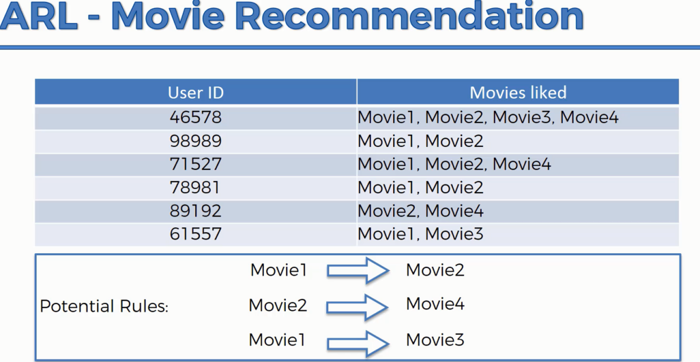
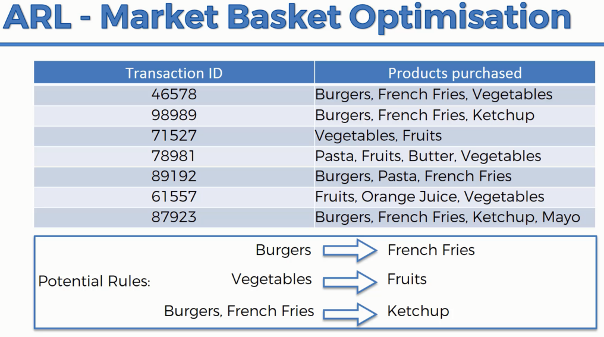
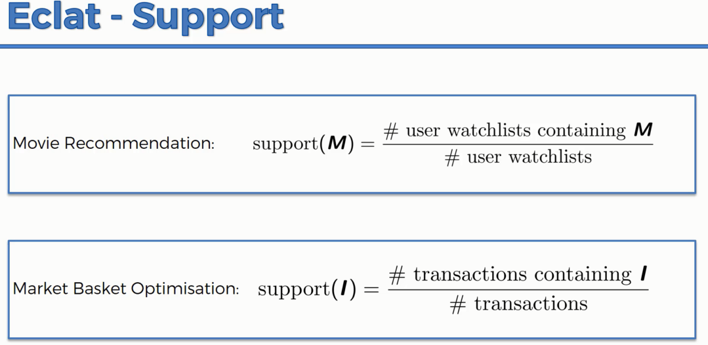
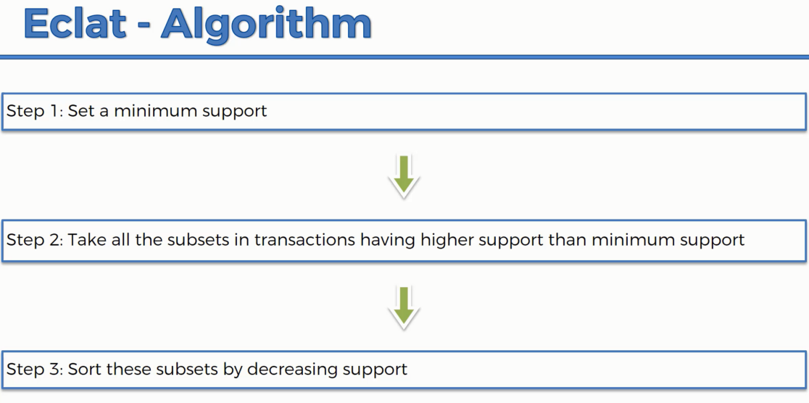
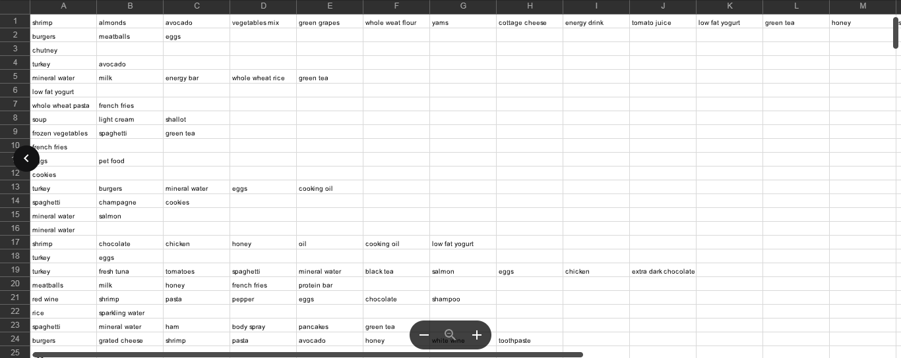
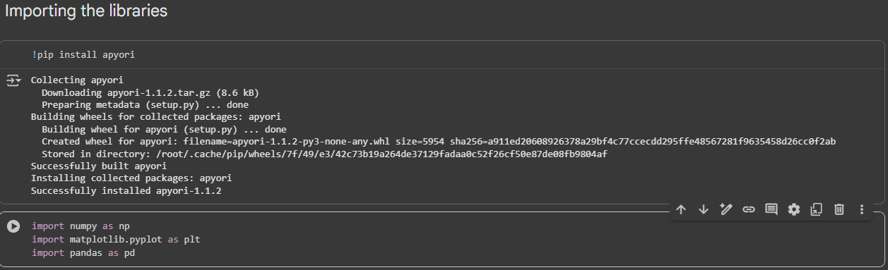
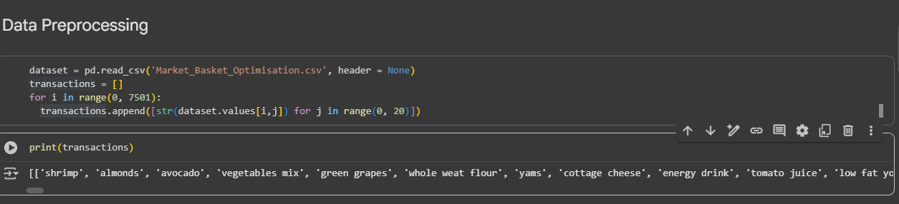
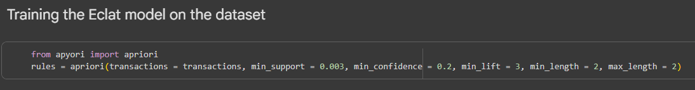
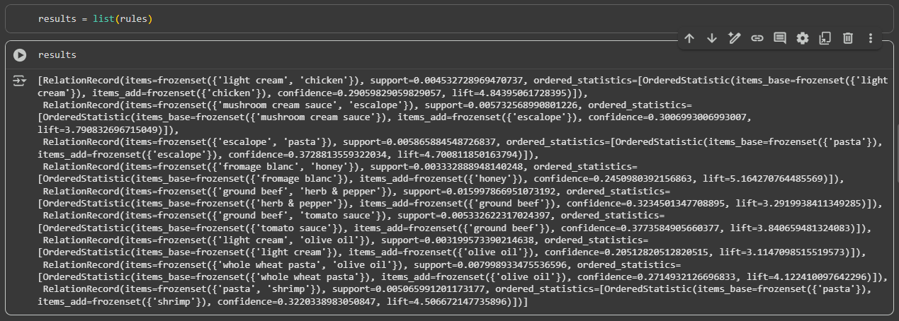
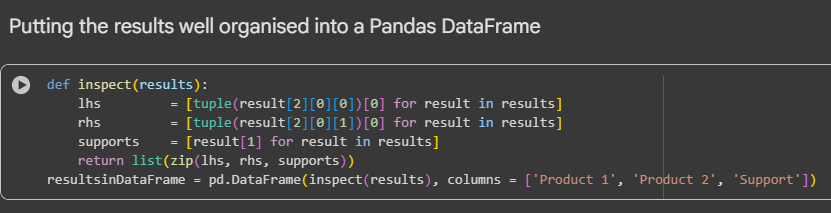

# Eclat Intuition

&nbsp;&nbsp;&nbsp;Today we're continuing exploring association rule learning and we're talking about the intuition behind the `Eclat` model. So the `Eclat` model is very, very simple. After we have already studied the A Priori model, it's kind of like a simplified version. Alright, so let's have a look. It also talks about, the `Eclat` model also talks about "people who bought, also bought". So it's kind of like a recommender system. And similar to what we had in the A Priori algorithm, here we've got for instance, movies and we've got some potential rules. So basically exactly the same things, if you've got your movie list or movies that people liked, people who like movie one, or just generally looks like if somebody likes movie one, they're very likely to like movie two. If they like movie two, they're likely to like movie four. If they like movie one, they might like movie three. Again, these rules have, will have different strength, but here we aren't actually going to be talking about rules per se because the `Eclat` model is different to the A Priori model. In the Priori model, we came up with rules towards the end, that's the output and we, based on the lift, we could judge the strength of each rule. Whereas here we are going to be talking about sets and you'll see why just now. So here we've got the market basket as optimization. 

&nbsp;&nbsp;&nbsp;Same thing that people who buy burgers are likely to buy french fries as well. People who buy vegetables are likely to buy fruits, and these are just some potential rules. So we're not saying they're strong or some potential outcomes that we're looking at.   
We're not saying that they're strong or we're not selecting and we're just saying what could potentially be. And then the `Eclat` model is the responsible for actually going through all of these combinations and telling us what we should focus on. 

&nbsp;&nbsp;&nbsp;Alright, so in the `Eclat` model, just like in the A Priori model, we have the support factor. So previously in the A Priori model we had, or the algorithm we had support, we had confidence, and we had lift. In the `Eclat` model, we only have support. So we only are looking at, okay, so people who are watching a certain combinations of movies, how often does this happen? And here, just bear in mind that M doesn't mean just one movie. And this was the same for A Priori. It was just easier for us to understand the intuition based on one movie or one product. But actually M and I, what they stand for is a set of items or a set of movies. So as specifically in the `Eclat` model, it doesn't really make sense to look at, you know, an item by itself because we don't have the confidence and the lift factors. We're only looking at support. So we're just looking at how frequently does this set of items occur. So if we're just gonna look at a set of items which contains only one item, then we're just looking at the frequency at how, what is the popularity of movies? And that is very trivial. So we're not going to be looking at that. We're going to be aiming for at least two items in a set. And therefore M here stands for a set of two movies or more. And what we're calculating for a support, we're calculating, okay, what is, how often does this set of two movies, let's say, Interstellar and X Machine, how often does it occur in all of the watch lists? Or what percentage of watch lists, or what percentage of lists of movies that people liked, contain those two together? Not just one of them, but those two together. And let's say, hypothetically, if 100% of the lists that you had in a large data set contain both movies together then that would imply that, you know, anybody who likes Interstellar likes X Machine, anyone who likes X Machine likes Interstellar, and pretty much so if anybody has seen even one of those movies that you need to recommend that movie, the other one to them. Or if you had like 80% of your lists had those two movies together that basically means there's a high likelihood that they come in pairs, right? That if somebody liked one of them then they'll like that one. Same thing for transactions. Like if you have chips and burgers and, you know, 75% of all of your orders, right? Then if somebody's just buying burgers, then they'll likely to, then when you recommend chips to them, there's a 75% chance that they will also be interested or will like to buy chips with their burgers. And it's a very, very trivial approach. And that's pretty much it. That's all there is to the `Eclat` model.

&nbsp;&nbsp;&nbsp;It's much faster, and the steps involved are set a minimum support, so you want to set your support level at which you want to only below which you want to disregard anything, then you take all the subsets in transactions having higher support then the min support and then you sort the subset in decreasing support. And basically at the top you will have the strongest combinations of items, which you should look at. Maybe, you know, you'll look at the top 10 or top file or something like that. So that's pretty much it. That's all the `Eclat` model is. And as you can see, it's much easier to understand after you already know a bit about the A Priori. Alright, hope you enjoyed this tutorial, and off we go to Hadlan to implement this in practice. And I'll see you here next time. Until then, happy analyzing.

# Eclat in Python

