# SVR Intuition Updated

&nbsp;&nbsp;&nbsp;And today we're kicking off the `Support Vector Regression` Intuition. Well Support Vector Regression was invented back in the '90s by Vladimir Vapnik and his colleagues who were working at the Bell Labs at the time that was the AT & amp;T Bell Labs. Now they're Nokia Bell Labs and a lot of Support Vector Machine and Support Vector Regression are discussed in Vladimir Vapnik's book, "The Nature of Statistical Learning, 1992". In this course, we will be covering both Support Vector Machine in the part of the course to do with classification and Support Vector Regression. We'll be talking about it here. And in addition to that, we'll also be talking about Kernel Support Vector Machine and Kernel Support Vector Regression and the Kernel Trick and many other things like that.

&nbsp;&nbsp;&nbsp;Here we've got two plots and we need that in order to compare SVR to the simple linear regression that'll really help us understand things. So here on the left, we've got some random plots, or random dots. I'm gonna copy them over to the right. So we know that these are identical. There's no tricks involved. This is an absolutely identical set of data. And let's start with the one on the left.  
&nbsp;&nbsp;&nbsp;We're gonna apply a simple linear regression. We've already discussed what it's like but let's quickly refresh. So basically we're gonna have this line go through the data and how's this line derived?  
Well, a method called the ordinary least squares method will be applied to find this line. Basically, we want to minimize the distance between this value, why the actual value in the data and why hat, basically what it would've been on the trendline. We take the difference here or difference here, we square it and we wanna minimize that. That's ordinary least squares method. Essentially, what we're doing is minimizing the error. We want to have a line with the minimum error possible. So that's the intuition behind a simple linear regression, something we already talked about.  
&nbsp;&nbsp;&nbsp;Now, how does the Support Vector Regression work? Well, let's have a look on the right. With SVR, instead of a simple line, you'll see a tube. And here you have the regression line in the middle but then there's this tube around it and what does this tube do? Well, this tube has a width of epsilon and the width has measured vertically. It's important along this axis, not perpendicular to the tube but vertically. And this tube itself is called the epsilon-insensitive tube. And what does that mean?  
&nbsp;&nbsp;&nbsp;Well, that means that any points in our data set that fall inside the tube, they won't be, we'll be disregarding the error. So basically this tube, think of it as a a margin of error that we are allowing our model to have and not care about any error inside here. So any discrepancy between or any like distance between this point over here and the line as in, for instance here, we could see, let's look at which point is that? That's one, two, three. This third point, you can see the line is even different, right? The results can be different and probably will be different. So this third point here, there's a distance between the line here and we care about this error here. We don't care about this error because it falls within this epsilon- insensitive tube. So we're disregarding any kind of errors in here. And that's kind of the key behind Support Vector Regression. It gives a little bit of movement or a little bit of buffer to our model. And at the same time we have points that are outside the epsilon-insensitive tube. There they are. And for them we do care about the error. And here it will be measured as the distance between the point and the tube itself. So not the trendline, but the tube itself. These distances have names, they're either xC star, if the point is below the tube, or xC, if the point is above the tube. And they're called, so these values xC are called slack variables. So it's either xC star, if it's below, xC far star, if it's above. And we do care about the error. So we care about these distances and the way we care about it, so we're gonna try to avoid formulas. I will give additional reading, something you can look into further down at the end of this tutorial. But just for completeness sake, here is the formula. So in the case of OLS, it was a simple, ordinary least squared like that. Here's a bit more complex. We're not gonna talk about this part over here but what we're focusing on is this. And we can see that we are minimizing, we want these distances, the sum of these distances to be minimal. Once again, there'll be additional reading at the end if you'd like to go into it. But effectively these points, the ones that are outside our tube are dictating what the tube will look like, how the tube will be positioned. So the error within the tube is completely disregarded. We don't care about the error unlike in the ordinary least square. So we're giving some kind of buffer of flexibility to our tube or in like allowing it to, accounting for some kind of error that we might expect in the data. It's normal sometimes for there to be error but these ones, they are important to us. And also one final thing,

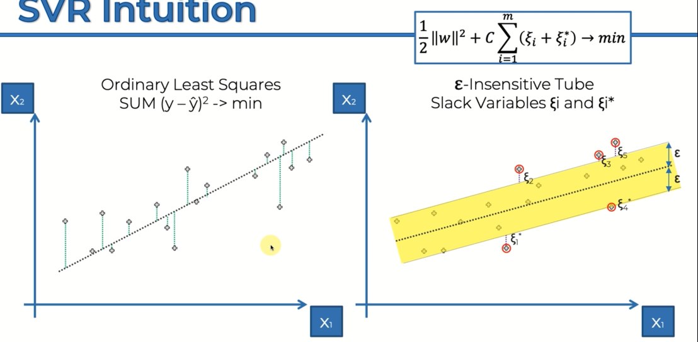

&nbsp;&nbsp;&nbsp;Why is this a method called Support Vector Regression? Well, because effectively, these points, all of these points outside, but any point actually, any point on this plot is a vector, right? Can be represented as a vector in this two dimensional space or a multidimensional space if you have more features. So in this case it can presented by two dimensional victors. So they are all these points of vectors but the ones that we've highlighted and read, the ones outside the tube, they're the support vectors because they are dictating how this tube is created. So basically they're supporting the structure or formation of this tube. And that's why they're called support vectors. And that's why this is a Support Vector Regression. And so there we go. That's what it's all about. That's just important to remember the epsilon-insensitive tube and that Support Vector Regression just cares about the errors of anything that's lying outside this tube.

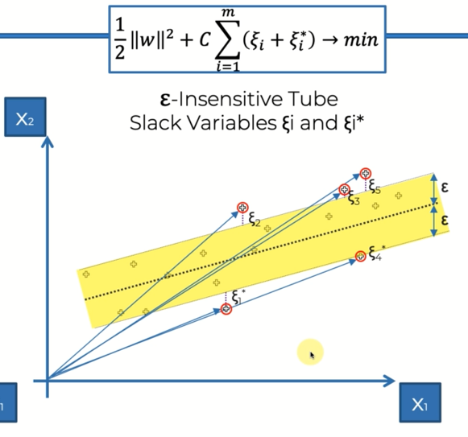

# SVR in Python 

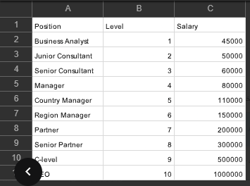  
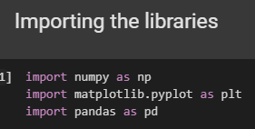  
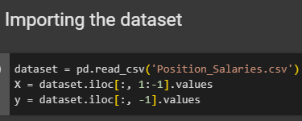  
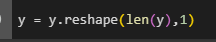  
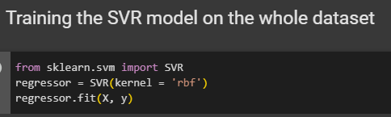  
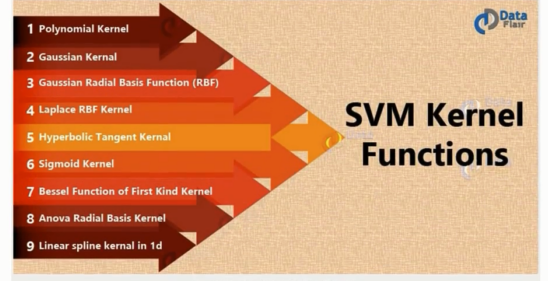  
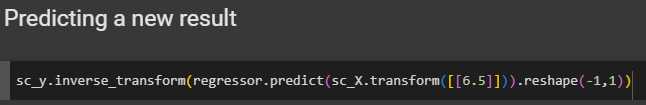  
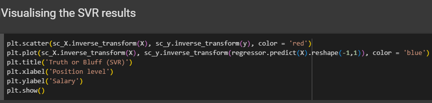  
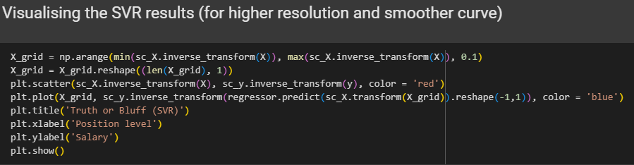

  

